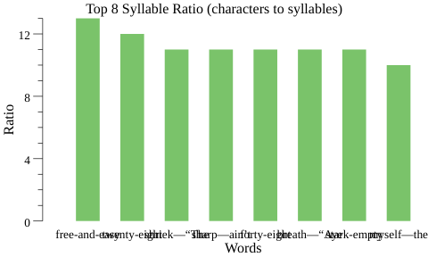
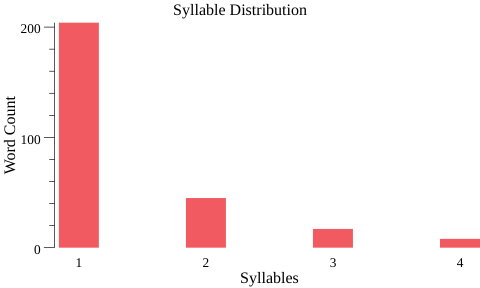
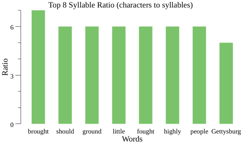
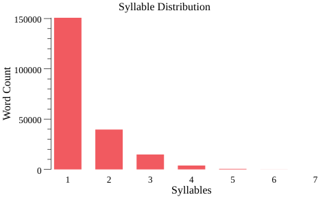
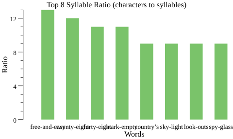
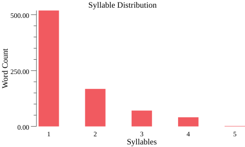
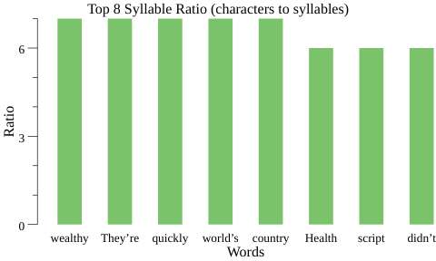

# Flesch Index Checker

## Summary

The purpose of this tool is to demonstrate my ability to process data for a graduate level course in machine learning. 
The Flesch Index is a score that indicates approximate textual complexity of a passage based upon a fairly simple 
formula. The language of machine learning is Python, but as an experienced developer I have chosen to explore another 
alternative to broaden my horizons. Therefore, this project uses Go to calculate and produce visualizations that 
describe readability characteristics of documents.

### Language and Library Choice

Besides professional broadening ambitions, there are a number of good reasons to choose Go for numerical analysis. Go is 
a 12-year-old re-imagining of low level programming languages with modern conveniences like low latency garbage 
collection (orders of magnitude lower than Java), fantastic concurrency primitives (emphasizing sharing memory by 
communicating instead of communicating by sharing memory), and a new approach to Object Oriented Programming that 
combines the duck typing of Python with stricter types than C++ (even widening operations must be explicit). 
Additionally, there is not (currently) any parametric polymorphism and there is neither inheritance, nor try-catch 
blocks. Instead, the programmer is forced to be brutally explicit, handle every error at the point it might occur, and 
all with a minimal set of keywords in the language -- 30 as compared to 32 in plain C. All of these aims are ambitious, 
but Go was developed at Google through a dream team of technical giants -- those who saw our first successes and 
enduring mistakes in language design, namely Ken Thompson (Unix, Plan 9, UTF-8, B language, regular expressions), Rob 
Pike (Unix, Plan 9, UTF-8, Limbo programming language, Inferno OS, Acme text editor), Robert Griesemer (V8 JavaScript 
engine, Sawzall, Java HotSpot vm, Strongtalk), and other notable figures from computer science history.

In terms of machine learning or numerical analysis in general, the great depth of tooling provided by Python is 
unmatched. However, the gonum organization on Github maintains several libraries that attempt to match features provided 
by major Python packages:

- Python
  - numpy: The fundamental package for scientific computing with Python. (https://github.com/numpy/numpy).
  - matplotlib: Matplotlib is a Python 2D plotting library which produces publication-quality figures in a variety of 
  hardcopy formats and interactive environments across platforms (https://github.com/matplotlib/matplotlib).
- Go
  - gonum: A set of numeric libraries for the Go programming language. It contains libraries for matrices, statistics, 
  optimization, and more (https://github.com/gonum/gonum).
  - plot: A repository for plotting and visualizing data (https://github.com/gonum/plot).
  
In terms of alternatives for Go, there really aren't any. Gonum has compiled the best tools of what the community has 
assembled, and the usage of Go in this domain is not large enough for competition at the moment.

Besides clear 
advantages in strong types, speed, and explicit error checking, Go also has better first class support for UTF-8 than 
Python does. Source code, runtime string representations, and default encoding are all defined as UTF-8, making the 
handling of angled quotes, em-dashes, or other multi-byte characters easy. Instead of handling the basic unit of a 
character in terms of bytes by default, Go uses UTF-8 code points as a basic unit, referring to them as "runes". In 
textual projects, this greatly reduces complexity. 

## Execution

In this case, the test material will be provided by public sources available from The Gutenburg Project.
- NY Times article on Health Care
- Lincoln's Gettysburg Address
- Moby Dick

### Formula

Flesch_Index = 206.835−84.6 (𝑛𝑢𝑚𝑆𝑦𝑙𝑙𝑎𝑏𝑙𝑒𝑠 / 𝑛𝑢𝑚𝑊𝑜𝑟𝑑𝑠)−1.015 (𝑛𝑢𝑚𝑊𝑜𝑟𝑑𝑠 / 𝑛𝑢𝑚𝑆𝑒𝑛𝑡𝑒𝑛𝑐𝑒𝑠)

The readability table and Kincaid alternative formula are from 
[Wikipedia](https://en.wikipedia.org/wiki/Flesch%E2%80%93Kincaid_readability_tests)

### Sentence

Consider a sentence to have been encountered whenever you find a word that ends in a specific punctuation symbol: a 
period, question mark, or exclamation point.

### Word

A word is a contiguous sequence of alphabetic characters.  Whitespace defines word boundaries.

### Syllable

A syllable is considered to have been encountered whenever you detect:
- Rule 1:  a vowel at the start of a word or
- Rule 2:  a vowel following a consonant in a word
One exception to Rule 2: a lone ‘e’ at the end of a word does not count as a syllable.

### Adjustments, Experiments, and Issues

- Formula Adjustments
  - The rules for measuring a syllable resulted in a large number of words with zero syllables (the, rhythm, and more). 
  Upon research, I noted other implementations always count three letter words as one syllable. This isn't technigally 
  correct for some words (e.g. ago) but might be a sufficient proxy to represent the simplicity of three letter words. I 
  added an additional one syllable minimum for all words to resolve the remaining anomalies. Test cases like the one 
  below check for zero values on any of the measured metrics. 
  - Any type of parens, quotes, colon, all sentence stops, and em dash are valid word stops.
  - Semi-colons are valid sentence stops
  
```
func TestNoZeroLengths(t *testing.T) {
	for _, d := range loadTestDocuments(t) {
		numberOfSentences := len(d.Sentences)
		if numberOfSentences == 0 {
			t.Errorf("expected more than zero sentences in %s", d.Name())
		}

		for sentenceIndex, s := range d.Sentences {
			numberOfWords := len(s.Words)
			if numberOfWords == 0 {
				t.Errorf("expected more than zero words in sentence #%d of %s", sentenceIndex, d.Name())
			}

			for wordIndex, w := range s.Words {
				numberOfSyllables := w.Syllables()
				if numberOfSyllables == 0 {
					t.Errorf("expected more than zero syllables in word #%d ('%s') of sentence #%d of %s",
						wordIndex, w, sentenceIndex, d.Name())
				}
			}
		}
	}
}
```

- Issues
  - Moby Dick presenting a large number of atypically abridged words such as "free-and-easy", words with an apostrophe 
  in the place of vowels such as "unfort’nate" or words abridged with an em-dash (see below). The Top Syllable Ratio 
  (characters to syllables) chart helped me discover this issue with token categories. 
    - em-dashes were easy to fix and match correct modern English usage as a word ender.
    - Both hyphenated strings of words and apostrophes in the middle of words are very difficult to differentiate from 
    legitimate modern uses of both symbols without large lookup dictionaries. I did literary research to determine that 
    both are not usually watched for in Fleusch Index implementations and am considering special treatment to be out of 
    scope for this tool. The chart below, however, will still bring these anomalies to the user's attention.



### Report Generation

This report is generated through a Python tool named Grip. Using Python 3, the approximate command to install Grip 
(operating system dependent) is `pip3 install grip` and after running `python3 -m grip README.md`, this README.md will 
be served on the port specified. From there you can use your browser to print to PDF or a printer.

#### Output: GettysburgAddress.txt

```
$> fi -analysis=true GettysburgAddress.txt
Document: GettysburgAddress.txt

Flesch Reading Ease Score: 77.19
Readability: 7th grade 
Flesch–Kincaid Grade Level: 5.73

Detailed Analysis Follows:
/home/dan/.flesch-index-data/GettysburgAddress.SyllableDistribution.png
/home/dan/.flesch-index-data/GettysburgAddress.SyllableRatio.png
```





#### Output: MobyDick.txt

```
$> fi -analysis=true MobyDick.txt
Document: MobyDick.txt

Flesch Reading Ease Score: 73.52
Readability: 7th grade 
Flesch–Kincaid Grade Level: 6.66

Detailed Analysis Follows:
/home/dan/.flesch-index-data/MobyDick.SyllableDistribution.png
/home/dan/.flesch-index-data/MobyDick.SyllableRatio.png
```





#### Output: NYTimes.txt

```
$> fi -analysis=true NYTimes.txt
Document: NYTimes.txt

Flesch Reading Ease Score: 60.88
Readability: 8th & 9th grade 
Flesch–Kincaid Grade Level: 8.39

Detailed Analysis Follows:
/home/dan/.flesch-index-data/NYTimes.SyllableDistribution.png
/home/dan/.flesch-index-data/NYTimes.SyllableRatio.png

```





### Libraries and References

Besides gonum/plot, I have no other external references. All calculations are implemented in this project without any 
references outside the standard library. Standard library packages used are limited to error handing, tests, string 
format, tests, and IO.

## Limitations


Readability calculations are readily available online and in almost every word 
processing application, so there is no shortage of existing solutions to measure readability of text. Some tools even 
examine multiple languages, whereas this formula relies upon assuming English prose.
